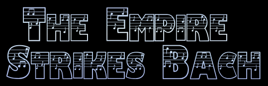

# [Melomeniac](https://md-ash-dot.github.io/classical-music-hackathon/)

=======

## Introduction
The Empire Strikes Bach Musical Quiz App is an interactive, educational tool designed to engage users with a variety of questions that explore musical knowledge. With a focus on different categories like instrument identification, sound recognition, and pop culture references, this app has the potential to cater to a wide range of audiences—from students learning about music theory to casual users interested in testing their musical knowledge. The site can be accessed through the [link](https://md-ash-dot.github.io/classical-music-hackathon/)

## Content

-   [Introduction](#introduction)
-   [UX](#ux)
    -   [Colour Scheme](#colour-scheme)
    -   [Typography](#typography)
-   [User Stories](#user-stories)
-   [Wireframes](#wireframes)
-   [Features](#features)
-   [Tools & Technologies Used](#tools--technologies-used)
-   [Collaborators](#Collaborators)
-   [Testing](#testing)
-   [Agile Development Process](#agile-development-process)
-   [Credits](#credits)

## UX

### User Experience

The Empire Strikes Bach musical quiz app is essential for creating an engaging, intuitive, and enjoyable interaction that keeps users returning for more. The UX design will focus on simplicity, engagement, accessibility, and a smooth flow from question to question. Below is a breakdown of the key UX elements for the app.

**The Ideal User**
- It ensure that first-time users understand the app's features and how to navigate through it without feeling overwhelmed.
- It provide a clear navigation and quick access to different quiz categories for any users.
- It Offers a clean, focused environment that makes answering questions fun and engaging.
- The APP Keep users motivated by making the quiz more interactive and competitive.
- Ensure a high-quality, smooth audio experience for sound-based questions for users.
- Make the app usable for a broad audience, including those with different accessibility needs.
- Maintain a fluid and logical flow through the app to minimize confusion and frustration.
-  Encourage users to continue engaging with the app after completing quizzes.
- Ensure a consistent experience across devices and platforms for users.
- Allow users to provide feedback easily.

**Site Goals**
- To provide a fun, interactive learning experience that enhances users’ musical knowledge.
- To keep users engaged and motivated to return to the site regularly.
-  Ensure the site is easy to navigate, intuitive, and offers a positive user experience.
- To attract a broad audience by providing a mix of educational and entertaining content.

### Colour Scheme

### Typography

### Wireframes

### Collaborators

### Testing

### Agile Development Process

### Credits
